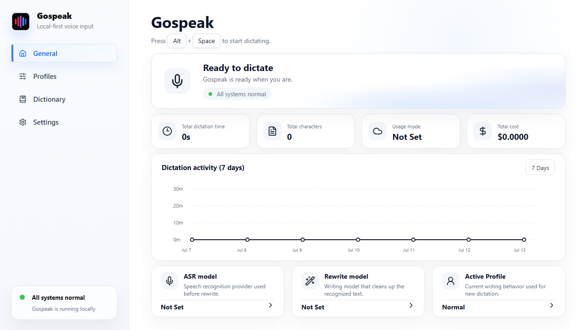

# Gospeak

Gospeak is a Windows-first Tauri Alpha for a local-first AI voice input app.
This Alpha implements an explicit multi-provider voice pipeline:

```text
global hotkey -> audio capture -> selected ASR -> selected rewrite -> clipboard paste
```

Live cloud calls require the corresponding user-supplied provider keys. The app can be
developed and tested without keys through mocked frontend behavior and Rust unit
tests.

## Screenshot



## Product Documents

- [Original PRD and technical architecture](docs/PRODUCT_PRD.md)
- [P0 status and next plan](docs/P0_STATUS_PLAN.md)

## Current Alpha Scope

- Tauri 2 + React + TypeScript app shell.
- Minimal Provider/model configuration for five ASR providers and two Rewrite providers.
- Batch ASR adapters for Groq Whisper, user-managed Qwen3-ASR 0.6B, remote
  Qwen3-ASR 1.7B, and Doubao Flash recording-file ASR.
- OpenAI Realtime ASR using `gpt-realtime-2`.
- Rewrite adapters for OpenAI Responses and DeepSeek V4 Chat Completions.
- Manual Start/Stop Dictation UI that records to a temporary WAV, runs the
  audio-file pipeline, copies and natively pastes the result, and then safely
  deletes Gospeak temp audio.
- `Alt+Space` global shortcut registration that emits a frontend event and uses
  the same dictation flow, with configurable Toggle and Push-to-talk modes.
- Tray actions and a compact always-on-top recorder window.
- App-aware Profile routing for foreground app/window-title rules.
- Speak to Edit mode that captures selected text, records a spoken edit
  instruction, rewrites the selected text, and pastes the replacement.
- OpenAI Realtime selection directly activates streaming dictation. Provider
  failures are returned without uploading audio to another Provider.
- Local light rewrite for short, safe Fast dictation cleanup, with model
  fallback when local rules are insufficient.
- A four-page General, Profiles, Dictionary, and Settings frontend. General
  shows privacy-safe all-time usage and cost totals.
- Prompt profile defaults for Normal, Email, Prompt, and Translate.
- Profile and dictionary editing UI backed by SQLite CRUD commands and consumed
  by the live STT/rewrite pipeline.
- Privacy-safe JSON import/export through native file dialogs.
- Raw-audio privacy, provider, hotkey, and active-profile preferences persisted
  locally. Unsupported transcript-history, history-sync, and
  transcript-in-crash-report controls are not exposed.
- Rust provider interface commands:
  - `check_provider_keys`
  - `save_provider_api_key`
  - `validate_alpha_pipeline`
  - `run_audio_file_dictation`
  - `start_recording`
  - `stop_recording`
  - `copy_text_for_paste`
  - `read_selected_text_for_edit`
  - `cleanup_temp_audio_file`
  - `get_foreground_app_context`
  - `list_profiles`
  - `upsert_profile`
  - `list_app_profile_rules`
  - `upsert_app_profile_rule`
  - `list_dictionary_terms`
  - `upsert_dictionary_term`
  - `list_usage_events`
  - `export_config_to_file`
  - `import_config_from_file`
- SQLite schema and Rust CRUD commands for preferences, prompt profiles,
  dictionary terms, and privacy-safe usage events.
- SQLite data lives in the OS App Data directory; an older working-directory
  database is migrated once on startup.
- API key storage uses the OS credential store through Rust `keyring`.
- Export payloads exclude API keys, raw audio, transcript history, and logs.

## Provider Support

| Capability | Provider | Model(s) | Mode | External API cost |
| --- | --- | --- | --- | --- |
| ASR | Groq | `whisper-large-v3-turbo`, `whisper-large-v3` | Batch | Recorded from audio duration |
| ASR | Qwen Local | `Qwen/Qwen3-ASR-0.6B` | Batch, loopback only | `0.0` (hardware/power excluded) |
| ASR | Qwen API | `Qwen/Qwen3-ASR-1.7B` | Batch, HTTPS | Unknown / not estimated |
| ASR | Doubao | `bigmodel` | Batch | Unknown / not estimated |
| ASR | OpenAI Realtime | `gpt-realtime-2` | Realtime | Unknown / not estimated |
| Rewrite | OpenAI | `gpt-5-nano`, `gpt-5-mini` | Batch and streaming | Recorded when token usage is complete |
| Rewrite | DeepSeek | `deepseek-v4-flash`, `deepseek-v4-pro` | Batch and streaming | Recorded when cache/output usage is complete |

Qwen Local is an external user-managed service and is not bundled or started by
Gospeak. See [Local Qwen3-ASR setup](docs/QWEN_LOCAL_ASR.md).

## Current Status And Remaining Work

- The Windows P0 Alpha, App-aware Profile routing, and Speak to Edit have
  user-reported manual acceptance recorded in
  [docs/P0_ACCEPTANCE_MATRIX.md](docs/P0_ACCEPTANCE_MATRIX.md).
- Multi-provider routing, adapter contracts, local light rewrite, and the latest
  frontend have automated coverage. Real-provider and current-build installed
  runtime acceptance remains pending where listed in the acceptance matrix.
- VAD, explicit provider retry, transcript history, automatic model download,
  and managed local-model lifecycle are not implemented.
- Sync folder and WebDAV remain deferred roadmap features.
- Public Beta planning is deferred while the current functional backlog is
  being prioritized.

## Development

```bash
npm install
npm run dev
npm run tauri dev
```

## Verification

```bash
npm test
npm run lint
npm run build
cd src-tauri
cargo test
cargo fmt -- --check
cargo clippy --all-targets --all-features -- -D warnings
```

Debug desktop build:

```bash
npx tauri build --debug
```

## Provider Credentials

The UI accepts credentials for Groq, OpenAI, optional Qwen API authentication,
Doubao, and DeepSeek. Keys are never written to SQLite or export payloads. In a
Tauri runtime they are saved to the OS credential store. Qwen Local has no key.
In a plain browser dev server, key save actions only update local UI state for
safe frontend testing.
